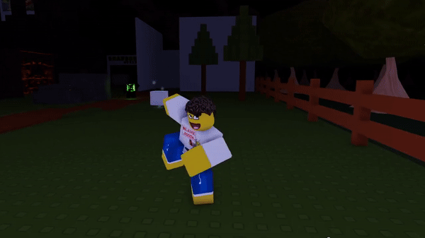
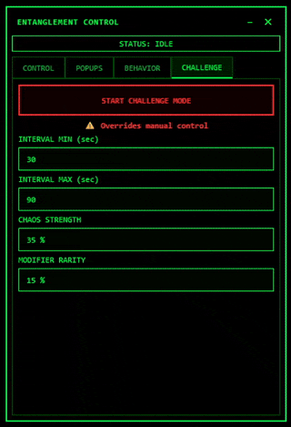

# 1x1x1x1's Entanglement Minigame

Ever wanted to play 1x1x1x1's Entanglement minigame but just couldn't be bothered to join Forsaken?
Ever wanted 1x1x1x1 to just mess you up in the middle of a game?
No? Just me?
Ok, well this program does just that, shoves the minigame straight into your desktop, forcing you to complete it before letting you do anything else with your pc.
This program also adds some unique twists to make your experience worse.

**This program is intentionally disruptive.**
Be aware of that.

## What happens

Once Entanglement starts, green static floods the screen and error windows begin spawning in random positions across all displays. Clicking anywhere on a popup dismisses it, but you’ll need to clear *all* of them before the static goes away and your desktop returns to normal. It's literally just like the minigame, idk why I had to explain it.

It’s simple and very good at messing up your Doors runs. (screw you, Ambush)

## Comparison

You've probably played Forsaken before if you're here, but just in case, here's what the minigame looks in-game.

## Features

This program is extremely configurable. Pretty much everything you see can be changed, tweaked, enabled, disabled, or made worse depending on how you want the minigame to behave. If something annoys you too much (or not enough), there’s probably a setting for it, and if there isn't, it'll probably get added in the future.

### Multi-Monitor Support

This program doesn’t care how many monitors you have. If you’ve got two, three, or more displays, the static and popups will spread across all of them. Clearing Entanglement means clearing *everything*, not just what’s on your main screen. (Well, except if you have multiple desktops.. but I'll probably patch in the future.. maybe)

### Error Popups

Unlike the actual minigame from Forsaken, this program adds some **Popup Variants** to go along with the default one. You can, of course, toggle each one of them, and if you really hate yourself, you can turn on all of them.

### Red Popups

These popups are even more evil than the normal ones, clicking one of these will spawn 5 normal popups. For this reason, you don't have to click them to finish the minigame.

### Strong Popups

Is your entanglement ending too soon? Well try our new **Strong Popups** only for 2000 KROMER!!! Yeah uhhh, you click them multiple times, that's it.

### Moving Popups

If you thought popups couldn't be dvd logos, think again. I'm not even gonna lie, this is a rlly good aim trainer.

### Splitting Popups

The splitting popups will replace some normal popups, clicking them will spawn 2 other popups, which can themselves be splitting popups (reason why Splitting Depth, which limits how many splitting popups can come out of other splitting popups)

### Suffer.

Yes, you can turn everything on at the same time.

### Challenge Mode

Challenge Mode is for people who don’t want to manually start Entanglement, or for people who want to suffer mid-game.

When enabled, the program will automatically trigger Entanglement at random intervals while it’s running. These triggers are unpredictable, configurable, and designed to interrupt you at the worst possible moments. You can control how often it happens, how intense it is, and whether it scales over time.

In short: Challenge Mode turns Entanglement from a button you press into a problem you have to live with... unless you disable it.

## Controls
- **F8** – Start Entanglement
- **F4** – Emergency Quit (alt+f4 works too)
- Tray icon – Restore / Quit

## Installation
1. Download the latest `.exe` from **Releases**
2. Run it
3. ???
4. Profit

## Disclaimer
This project is literally made just for the funzies.
If you do some funny shtuff with it, it ain't my fault.
Also, don't worry, this does not inject 57 horses into your personal computer, I ain't no John Doe.

:3
